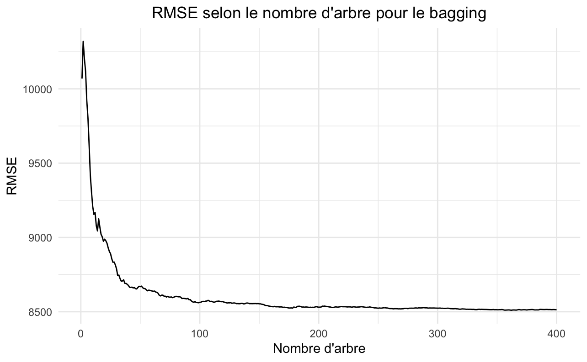

---
output:
  pdf_document:
    df_print: kable
    fig_caption: yes
    includes:
      before_body: "TP-title.tex"
      in_header: "preamble-latex.tex"
---  
\centering  

\clearpage  
  
\tableofcontents   

\justify  
\clearpage  

```{r setup, include=FALSE}
knitr::opts_chunk$set(echo = TRUE)
```

 
 
```{r paquetages, message=FALSE, eval=TRUE, include=FALSE, echo = FALSE}
### Liste des paquetages
liste.paquetage <- c("ggplot2", "maps", "mice", "graphics", "gridExtra", "caret", "gbm", "xgboost", "iml", "tidyverse", "adabag","randomForest", "rpart", "rpart.plot", "pROC", "cluster", "FactoMineR", "tweedie", "statmod", "FNN")

### On installe les paquetages de la liste qu'on a pas déjà
inst <- liste.paquetage %in% installed.packages()
if(length(liste.paquetage[!inst]) > 0) install.packages(liste.paquetage[!inst])

lapply(liste.paquetage, require, character.only = TRUE)
library(ggplot2)
library(maps)
library(mice)
library(graphics)
library(gridExtra)
library(caret)
library(gbm)
library(xgboost)
library(iml)
library(tidyverse)
library(adabag)
library(randomForest)
library(rpart)
library(rpart.plot)
library(pROC)
library(statmod)
library(tweedie)
library(cluster)
library(FactoMineR)
library(tweedie)
library(statmod)
library(FNN)
```

```{r data import, echo = F}
data <- read.csv("DonnéesTraitées.csv")
# On enleve la varible identité
data <- data[, -c(1)]
# Les variables sous le bon format
data$condominiumIndicator <- as.factor(data$condominiumIndicator)
data$communityRatingSystemDiscount <- as.factor(data$communityRatingSystemDiscount)
data$elevatedBuildingIndicator <- as.factor(data$elevatedBuildingIndicator)
data$locationOfContents <- as.factor(data$locationOfContents)
data$numberOfFloorsInTheInsuredBuilding <- as.factor(data$numberOfFloorsInTheInsuredBuilding)
data$occupancyType <- as.factor(data$occupancyType)
data$primaryResidence <- as.factor(data$primaryResidence)
data$totalCoverage <- data$totalBuildingInsuranceCoverage + data$totalContentsInsuranceCoverage

data <- subset(data, select = -c(totalBuildingInsuranceCoverage, totalContentsInsuranceCoverage))


## 85/15 pour le trainning et test
set.seed(1123581321)
ind.train <- sample(1:nrow(data), 0.85*nrow(data), FALSE)
dat.train <- data[ind.train,]
dat.test <- data[-ind.train,]
```


\newpage
# Introduction
<!-- Danny -->


\newpage
# Modèle de base
<!-- Félix & Henri -->

Le choix d'un modèle linéaire généralisé Tweedie est justifié dans notre étude pour plusieurs raisons. Tout d'abord, cette distribution est particulièrement adaptée pour modéliser la fréquence et la sévérité combinées des données de sinistres d'inondation, tout en prenant en compte leur nature asymétrique. De plus, cette distribution est paramétrée, ce qui permet de modéliser des relations complexes entre les variables explicatives et les montants de sinistres. Le modèle Tweedie retenu peut facilement intégrer des variables continues et catégorielles, ce qui est pertinent pour caractériser le jeu de données considéré. Enfin, l'interprétation des résultats est facilitée par la structure du modèle linéaire généralisé Tweedie, permettant de mieux comprendre les effets des variables explicatives sur les montants de sinistres. Ainsi, ce modèle servira de base efficace pour établir la prime de référence, dans le but d'évaluer la performance des autres modèles.

```{r GLM, echo = F, warning=F}
tweed.p <- 1.5
tweed.p <- tweedie.profile(
  totalAmount ~ .,
  data = dat.train,
  p.vec = seq(1.4, 1.8, 0.1),
  method = "series",
  do.plot = TRUE)$p.max

glm.tweed <- glm(
  totalAmount ~ .,
  data = dat.train,
  family = tweedie(var.power = tweed.p, link.power = 0),
  maxit = 300
)

summary(glm.tweed)
```

```{r GLM pred, echo = F}
glm.pred <- predict(glm.tweed, newdata = dat.test)
plot(glm.pred)
```

\newpage
# Ajustement des modèles
<!-- Collectif -->

\newpage
## Modèle des k plus proches voisins
<!-- Félix & Henri -->
```{r knn, echo = F}

### Création de data 2 pour éviter de #cancel le data original
data2 <- data

### Transformation de toutes les variables factoriel en valeur numérique
data2$condominiumIndicator <- as.numeric(data$condominiumIndicator)
data2$communityRatingSystemDiscount <- as.numeric(data$communityRatingSystemDiscount)
data2$elevatedBuildingIndicator <- as.numeric(data$elevatedBuildingIndicator)
data2$locationOfContents <- as.numeric(data$locationOfContents)
data2$numberOfFloorsInTheInsuredBuilding <- as.numeric(data$numberOfFloorsInTheInsuredBuilding)
data2$occupancyType <- as.numeric(data$occupancyType)
data2$primaryResidence <- as.numeric(data$primaryResidence)

### Utilisation de seulement les data avec un totalAmount plus grand que 0
data_no_0 <- data2[which(data2$totalAmount > 0), ]

### scaling xdf
data_no_0_sc <- cbind(sapply(data_no_0[, -12], scale), data_no_0[, 12])

### Creating training and testing set
data_no_0_training <- sample(1:nrow(data_no_0), 0.85 * nrow(data_no_0), FALSE)
data_no_0_train <- data_no_0_sc[data_no_0_training, ]
data_no_0_test <- data_no_0_sc[-data_no_0_training, ]

### setting things up for knn.reg
obs_train <- data_no_0_train[, -13]
obs_test <- data_no_0_test[, -13]
res_train <- data_no_0_train[, 13]
res_test <- data_no_0_test[, 13]

### Finding optimal K
n <- length(res_test)
knnpred_mat <- matrix(data = rep(0, 100 * length(res_test)), nrow = 100, ncol = length(res_test))
for(i in 1:100) {
    knnpred_mat[i, ] <- knn.reg(obs_train, obs_test, res_train, k = i)$pred
}
EQM <- numeric(100)
for(i in 1:100){
    EQM[i] <- 1 / n * sum((res_test - knnpred_mat[i, ]) ^ 2)
}
plot(EQM)
which.min(EQM) ## donc k optimal est 15
### optimal knn model with the no 0 dataset

pred_knn <- knn.reg(obs_train, obs_test, res_train, k = 15)
pred.knn <- pred_knn$pred
summary(pred.knn)
summary(res_test)
```
Pour construire un modèle de régression k-plus proche voisin, nous avons du tout d'abord transformer nos variables catégorielles en valeurs numériques. Cette étape fut nécessaire car nous voulions obtenir des chiffres plutôt que des classes. Après cette transformation, nous avons cherché à déterminer le facteur "k" optimal pour obtenir le meilleur modèle possible. Nous avons utilisé la méthode de l'erreur quadratique moyenne (EQM) pour évaluer la performance de notre modèle. Cette mesure est estimée à l'aide de la formule suivante: $$\frac{1}{n}\sum^{n}_{i = 1}[y_i-\hat{f}(x_i)]^2$$. 

Nous avons testé différentes valeurs de k allant de 1 à 100 et avons observé que l'EQM augmente après un certain point. Après avoir analysé le graphique, nous avons constaté que le k optimal pour notre modèle était de 15, car c'est à ce point que l'EQM atteint son minimum.

\newpage
## Arbre de décision
<!-- Félix & Henri -->

Dans le contexte de la modélisation de montants de réclamation en assurance inondation, il est important de trouver un modèle prédictif à la fois précis et interprétable. Les arbres de décision est très utile dans ce contexte car ils permettent une interprétation facile des résultats et la visualisation simple des règles de décision. Cependant, les arbres non élagués peuvent être très complexes et sujets à un surajustement.

Nous avons donc optimisé le paramètre de complexité pour l'élagage en utilisant une validation croisée LGOCV (Leave Group Out Cross Validation) à 10 ensembles, puis en minimisant la racine carrée de l'erreur quadratique moyenne (RMSE). L'optimisation du paramètre de complexité permet de trouver le bon niveau d'élagage pour éviter un surajustement tout en maintenant la précision prédictive du modèle.

```{r, arbre de régression}
set.seed(6969)
fit.control <- trainControl(method="LGOCV",
                            p = 0.9,
                            summaryFunction = defaultSummary,
                            classProbs = F,
                            )

cv.fitted.tree <- caret::train(totalAmount~.,
                                data=dat.train,
                                method="rpart",
                                tuneLength=10,
                                metric="RMSE",
                                trControl=fit.control
                                )
cv.fitted.tree
rpart.plot(cv.fitted.tree$finalModel)
```

```{r}
treepred <- predict(cv.fitted.tree, newdata = data.sev.test)
```


\newpage
## Bagging
<!-- Isabelle -->
```{r echo=FALSE}
# set.seed(12323)
# bag <- randomForest(totalAmount~.,
#                     data = dat.train,
#                     sampsize = nrow(dat.train),
#                     mtry = 12,
#                     ntree = 400,
#                     nodesize = 10,
#                     importance = TRUE,
#                     cp = 0)
```

Pour le bagging, on utilise le nombre de variables explicatives pour déterminer le nombre de variables prises en compte à chaque division de l'arbre de décision, soit 12. L'algorithme utilise également un échantillon avec remplacement de la même taille que l'échantillon des données d'entraînement.

```{r echo=FALSE}
# df.oob.bag <- data.frame(Tree = 1:400,
#                     RMSE = sqrt(bag$mse))
#
# ggplot(df.oob.bag, aes(x=Tree, y = RMSE ))+
#  theme_minimal()+
#  geom_line()+
#  labs(x = "Nombre d'arbre", title = "RMSE selon le nombre d'arbre pour le bagging")+
#  theme(plot.title = element_text(hjust = 0.5))
```


Le nombre d'arbres pour le bagging est déterminé à l'aide de la racine de l'erreur quadratique moyenne (RMSE), car le problème est de régression. En observant la figure ci-dessus, on constate que le nombre d'arbres se stabilise vers 200 arbres. Pour diminuer le temps de calcul, on prends 200 arbres même si un grand nombre d'arbres ne conduit pas à du surajustement.

Ensuite, l'hyperparamètre `nodesize` sera exploré pour prévenir le surajustement causé par des arbres trop profonds. Pour éviter un temps de calcul excessif, les valeurs manuellement testées pour nodesize vont de 500 et moins, en augmentant par bonds de 20.

```{r echo=FALSE}
# set.seed(131)
# ind.val.bag <- sample(1:nrow(dat.train), 0.2*nrow(dat.train), FALSE)
# dat.valid.bag <- dat.train[ind.val.bag,]
# dat.non.valid.bag <- dat.train[-ind.val.bag,]
#
# prev.nodesize.bag <- rep(NA, 25)
# for(i in (1:25)*20){
#   set.seed(4757)
#   bag.node <- randomForest(totalAmount~.,
#                             data = dat.non.valid.bag,
#                             ntree = 200,
#                             mtry = 12,
#                             sampsize = nrow(dat.non.valid.bag),
#                             importance = TRUE,
#                             nodesize = i)
#  
#  bag.node.prev <- predict(bag.node, newdata=dat.valid.bag, type="response")
#  prev.nodesize.bag[i/20] <- RMSE(bag.node.prev,dat.valid.bag$totalAmount)
# }
#
# min.node.bag <- which.min(prev.nodesize.bag)*20
#
# df.node.bag <- data.frame("Nodesize" = (1:25)*20 ,
#                     "RMSE" = prev.nodesize.bag 
#                      )
#
```

```{r echo=FALSE, warning=FALSE}
# ggplot(df.node.bag, aes(x=Nodesize, y = RMSE ))+
#   theme_minimal() +
#   geom_line() +
#   labs(x = "Nombre d'observations par noeud terminal", title = "RMSE selon le nodesize 
# pour le bagging") +
#  theme(plot.title = element_text(hjust = 0.5),
#        legend.position = "none") +
#  geom_line(aes(x = min.node.bag, color = "red"), linetype = "dashed") +
#    geom_text(aes(x = min.node.bag, y = 8200,
#    label = "nodesize = 80", vjust = 1.5, angle = 90))
```


La figure ci-dessus montre que le `nodesize` qui minimise l'RMSE se trouve autour de 80. On va donc tester toutes les valeurs entre 60 et 100 pour trouver la valeur optimale de l'hyperparamètre.

```{r echo=FALSE}
# prev.nodesize.tune.bag <- rep(NA, 41)
# for(i in (60:100)){
#   set.seed(4757)
#   bag.node.tune <- randomForest(totalAmount~.,
#                             data = dat.non.valid.bag,
#                             ntree = 200,
#                             mtry = 12,
#                             sampsize = nrow(dat.non.valid.bag),
#                             importance = TRUE,
#                             nodesize = i)
#  
#  bag.node.prev.tune <- predict(bag.node.tune, newdata=dat.valid.bag, type="response")
#  prev.nodesize.tune.bag[i-59] <- RMSE(bag.node.prev.tune,dat.valid.bag$totalAmount)
# }
#
# min.node.tune.bag <- which.min(prev.nodesize.tune.bag)+59
#
# df.node.tune.bag <- data.frame("Nodesize" = 60:100,
#                     "RMSE" = prev.nodesize.tune.bag 
#                     )
```

```{r echo=FALSE, warning=FALSE}
# ggplot(df.node.tune.bag, aes(x=Nodesize, y = RMSE ))+
#   theme_minimal()+
#   geom_line()+
#   labs(x = "Nombre d'observations par noeud terminal", title = "RMSE selon le nodesize 
# pour le bagging")+
#  theme(plot.title = element_text(hjust = 0.5), legend.position = "none")+
#  geom_line(aes(x = min.node.tune.bag, color = "red"), linetype = "dashed")+
#  geom_text(aes(x = min.node.tune.bag, y = 8170,
#    label = "nodesize = 97"), vjust = 1.5, angle = 90)
```


Dans la figure ci-dessus, on peut voir que la valeur de `nodesize` optimale est 97.

Les hyperparamètres optimaux pour le bagging sont donc les suivants : 

```{r echo=FALSE}

df.bag.final <- data.frame(
  "Hyperparamètre" = c("Nombre d'arbres", "Nombre d'observation dans les noeuds terminaux"),
  "Valeur" = c(200, 97)
)

knitr::kable(df.bag.final,caption = "Valeurs des hyperparamètres du modèle de bagging final")

```

```{r echo=FALSE}
set.seed(12323)
bag.final <- randomForest(totalAmount~.,
                    data = dat.train,
                    sampsize = nrow(dat.train),
                    mtry = 12,
                    ntree = 200,
                    nodesize = 97,
                    importance = TRUE,
                    cp = 0)
```


\newpage
## Forêt aléatoire
<!-- Danny -->


```{r forest, cache=TRUE, echo = F}

# set.seed(36738)
# foret <- randomForest(totalAmount~.,
#                       data = dat.train,
#                       nodesize = 10,
#                       mtry = 4,
#                       importance = T,
#                       cp = 0,
#                       sampsize = floor(0.5*nrow(data)),
#                       ntree = 400
#                       )

```

Pour la forêt aléatoire, on commence avec quatres prédicteurs possibles pour chaque séparation, $i.e. \ m=4$, car $\lfloor 12/3 \rfloor = 4$. Cette valeur correspond à la "règle du pouce" en régression où l'on utilise la partie entière du nombre de valeurs explicatives divisé par 3. Deplus, en utilisant une proportion de de 50% pour les échantillons bootstrap, on aide a diminuer la corrélation entre les arbres.

\vspace{8pt}

```{r forest-tree, cache=TRUE,echo = F , warning=F,  fig.dim= c(7,3)}

# df.oob <- data.frame(Tree = 1:400,
#                      RMSE = sqrt(foret$mse))
# 
# ggplot(df.oob, aes(x=Tree, y = RMSE ))+
#   theme_minimal()+
#   geom_line()+
#   labs(x = "Nombre d'arbre", title = "RMSE selon le nombre d'arbre")+
#   theme(plot.title = element_text(hjust = 0.5))

```


\vspace{8pt}

Étant en régression, la racine de l'erreur quadratique moyenne, ou RMSE, sera utilisée comme mesure de comparaison. On remarque ici (Graphique no. #) que la RMSE se stabilise aux alentours de 100-150 arbres, on utilisera alors 200 arbres pour l'optimisation des autres hyperparamètres, puisqu'on ne peut pas surajuster en ayant trop d'arbre avec les forêts aléatoires. Maintenant, on regarde plus en profondeur le nombre de prédicteurs possible à chaque séparation d'un arbre, la variable `mtry`. 


```{r forest-tunning, cache=TRUE, echo=FALSE}

# control <- trainControl(method= "cv", number=5)
# 
# grille <- expand.grid(mtry = 1:12)
# 
# set.seed(984532)
# foret.tuning <- caret::train(totalAmount~.,
#                   data = dat.train,
#                   method = "rf",
#                   metric = "RMSE",
#                   tuneGrid = grille,
#                   trControl = control,
#                   sampsize = floor(0.5*nrow(dat.train)),
#                   ntree = 200,
#                   nodesize = 50)


```

\vspace{8pt}

```{r forest-mtry, echo=FALSE, cache=TRUE}
forest.rmse <- c(8848, 8660, 8527, 8457, 8408, 8379, 8366, 8352, 8367, 8356, 8360, 8361)

df.forest.mtry <- t(data.frame(mtry = round(1:12),
                          RMSE = forest.rmse))

knitr::kable(df.forest.mtry,caption = "RMSE par rapport au mtry")

best.mtry <- which.min(forest.rmse)
```

\vspace{8pt}
 
Les résultats de la table no. # ont été obtenus par validation croisée à 5 plis, pour ainsi réduire le biais d'échantillonage. L'utilisation des `r best.mtry` choix de variables explicatives à chaque noeud minimise la RMSE.

Pour éviter un surajustement dû à des arbres inutillemnet trop profonds, on devra ajuster la valeur de `nodesize`, mais il est impossible de le faire directement avec le package `caret`. Puisque le modèle est entraîné sur `r nrow(dat.train)` observations, les valeurs de 500 et moins seront testées et comparées.
Pour limiter le temps de calcul, un premier entraînement sera fait par bond de 20.

```{r forest-nodesize, echo = FALSE, cache=TRUE, message=FALSE}
## Création de l'échantillon de validation, 20% des observations d'entraînement
# set.seed(95751)
# ind.val <- sample(1:nrow(dat.train), 0.20*nrow(dat.train), FALSE)
# dat.valid <- dat.train[ind.val,]
# dat.non.valid <- dat.train[-ind.val,]
# 
# # Optimiser nodesize sur l'échantillon de validation de 20 à 1000 par bond de 20
# prev.nodesize.rmse <- rep(NA, 25)
# for(i in (1:25)*20 ){
#   
#   set.seed(897941)
#   foret.node <- randomForest(totalAmount~.,
#                       data = dat.non.valid,
#                       nodesize = i,
#                       mtry = best.mtry,
#                       importance = T,
#                       cp = 0,
#                       sampsize = floor(0.5*nrow(dat.non.valid)),
#                       ntree = 200)
#   
#   foret.node.prev <- predict(foret.node, newdata=dat.valid, type="response")
#   prev.nodesize.rmse[i/20] <- RMSE(foret.node.prev,dat.valid$totalAmount)
#   
# }
# 
# 
# min.node <- which.min(prev.nodesize.rmse)*20
# 
# 
# df.node <- data.frame("Nodesize" = (1:25)*20 ,
#                      "RMSE" = prev.nodesize.rmse 
#                      )

```

\vspace{8pt}

```{r forest-nodesize-rmse, fig.dim= c(7,3), echo=FALSE, warning=FALSE}

# ggplot(df.node, aes(x=Nodesize, y = RMSE ))+
#   theme_minimal()+
#   geom_line()+
#   labs(x = "Nombre d'observations par noeud terminal", title = "RMSE selon le nodesize")+
#   theme(plot.title = element_text(hjust = 0.5), legend.position = "none")+
#   geom_line(aes(x = min.node, color = "red"), linetype = "dashed")+
#   annotate(geom = "text",
#            label = paste("nodesize =",as.character(min.node)),
#            x = min.node,
#            y = prev.nodesize.rmse[min.node],
#            vjust = 1.5,
#            angle = 90)

```


\vspace{8pt}

Dans le graphique no. #, la valeur minimale de nodesize est de 20. Puisque l'analyse précédente à été effectuée par bonds de 20, on la fera à nouveau, de manière plus précise, entre 1 et 40. 

\vspace{8pt}

```{r forest-nodesize-tune, echo = FALSE, cache=TRUE, message=FALSE}

# # Optimiser nodesize sur l'échantillon de validation de 1 a 40
# prev.nodesize.rmse.tune <- rep(NA, 40)
# for(i in 1:40 ){
#   
#   set.seed(897941)
#   foret.node.tune <- randomForest(totalAmount~.,
#                       data = dat.non.valid,
#                       nodesize = i,
#                       mtry = best.mtry,
#                       importance = T,
#                       cp = 0,
#                       sampsize = floor(0.5*nrow(dat.non.valid)),
#                       ntree = 200)
#   
#   foret.node.prev.tune <- predict(foret.node.tune, newdata=dat.valid, type="response")
#   prev.nodesize.rmse.tune[i] <- RMSE(foret.node.prev.tune,dat.valid$totalAmount)
#   
# }
# 
# 
# min.node.tune <- which.min(prev.nodesize.rmse.tune)
# 
# 
# df.node.tune <- data.frame("Nodesize" = 1:40 ,
#                      "RMSE" = prev.nodesize.rmse.tune 
#                      )

```


```{r forest-nodesize-rmse-tune, fig.dim= c(7,3), echo=FALSE, warning=FALSE}

# ggplot(df.node.tune, aes(x=Nodesize, y = RMSE ))+
#   theme_minimal()+
#   geom_line()+
#   labs(x = "Nombre d'observations par noeud terminal", title = "RMSE selon le nodesize")+
#   theme(plot.title = element_text(hjust = 0.5), legend.position = "none")+
#   geom_line(aes(x = min.node.tune, color = "red"), linetype = "dashed")+
#   annotate(geom = "text",
#            label = paste("nodesize =",as.character(min.node.tune)),
#            x = min.node.tune,
#            y = prev.nodesize.rmse.tune[min.node.tune]+80,
#            vjust = 1.5,
#            angle = 90)

```


\vspace{8pt}

Dans le graphique no. #, la valeur minimale de `nodesize` est de 27. 

Par conséquent, les hyperparamètres finaux pour le modèle "Forêt aléatoire" sont ceux décrits dans la table suivante.

\vspace{8pt}

```{r forest-parametre-final, cache=TRUE, echo=FALSE}

df.forest.final <- data.frame(
  "Hyperparamètre" = c("Nombre d'arbres", "Nombre de choix de variables à chaque noeud", "Nombre d'observation dans les noeuds terminaux"),
  "Valeur" = c(200, 8, 27)
)

knitr::kable(df.forest.final,caption = "Valeurs des hyperparamètres du modèle final")

```


```{r forest-model-final, cache=TRUE, echo=FALSE}

set.seed(963852)
foret.final <- randomForest(totalAmount~.,
                      data = dat.train,
                      nodesize = 27,
                      mtry = 8,
                      importance = T,
                      cp = 0,
                      sampsize = floor(0.5*nrow(data)),
                      ntree = 200,
                      )
```


\newpage
## Gradient Boosting
<!-- Danny -->

On commence par entraîner un modèle GBM par validation croisée à 5 plis. On testes les valeurs de la taille maximale de chaque arbre $\{5,10,15\}$ et un nombre d'itérations entre 1000 et 6000 par bonds de 1000, tout en utilisant un paramètre d'apprentissage, $\lambda = 0.01$. 


```{r gradient, cache=TRUE, echo=FALSE}

# controles <- trainControl(method="cv", number= 5)
# 
# gbmGrille <-  expand.grid(n.trees = seq(1000,6000, 1000),
#                          interaction.depth = c(5,10,15),
#                          shrinkage = 0.01,
#                          n.minobsinnode = 50)
# 
# 
# set.seed(234137)
# 
# mod.gbm <- caret::train(totalAmount~.,
#                 data = dat.train,
#                 method = "gbm",
#                 trControl = controles,
#                 tuneGrid = gbmGrille,
#                 verbose = FALSE,
#                 metric = "RMSE")
```

```{r gradient-plot, echo=FALSE, cache=TRUE}
# plot(mod.gbm)
```


On voit dans le graphiq no. # qu'une profondeur de 15 et qu'environ 4000 arbres minimisent la RMSE. Une profondeur de 15 semble suffisante pour capter les intérations entre les variables, sans trop faire exploser le temps de calcul. Il est difficile de voir le nombre idéal.

```{r gradient-tune, cache=TRUE, echo=FALSE}

# controles <- trainControl(method="cv", number= 5)
# 
# gbmGrille.tune <-  expand.grid(n.trees = seq(2500,4500, 500),
#                          interaction.depth = 15,
#                          shrinkage = 0.01,
#                          n.minobsinnode = 50)
# 
# 
# set.seed(234137)
# 
# mod.gbm.tune <- caret::train(totalAmount~.,
#                 data = dat.train,
#                 method = "gbm",
#                 trControl = controles,
#                 tuneGrid = gbmGrille.tune,
#                 verbose = FALSE)
```

```{r gradient-plot-tune, echo=FALSE, cache=TRUE}
plot(mod.gbm.tune)
```


Après avoir fait une analyse plus précise, on remarque que 3000 itérations est optimal, et les paramètres finaux seront cex décrit à la table suibante.

```{r gbm-parametre-final, cache=TRUE, echo=FALSE}

df.gbm.final <- data.frame(
  "Hyperparamètre" = c("Nombre d'arbres", "Profondeur de chaque arbre", "Taux d'apprentissage"),
  "Valeur" = c(3000, 15, 0.01)
)

knitr::kable(df.gbm.final,caption = "Valeurs des hyperparamètres du modèle final")

```

```{r gbm-model-final, cache=TRUE, echo=FALSE}

controles <- trainControl(method="cv", number= 5)

gbmGrille.fin <-  expand.grid(n.trees = 3000,
                         interaction.depth = 15,
                         shrinkage = 0.01,
                         n.minobsinnode = 5)

set.seed(963852)
gbm.final <- caret::train(totalAmount~.,
                data = dat.train,
                method = "gbm",
                trControl = controles,
                tuneGrid = gbmGrille.fin,
                verbose = FALSE)
```


\newpage
# Comparaison des modèles
<!-- Collectif -->

\newpage
# Interprétation des meilleurs modèles
<!-- Maryjane -->


\newpage
# Conclusion
<!-- Isabelle -->

 
\newpage
# Bibliographie

The Federal Emergency Management Agency (2023). FIMA NFIP Redacted Claims - v1.

Récupéré de https://www.fema.gov/openfema-data-page/fima-nfip-redacted-claims-v1


